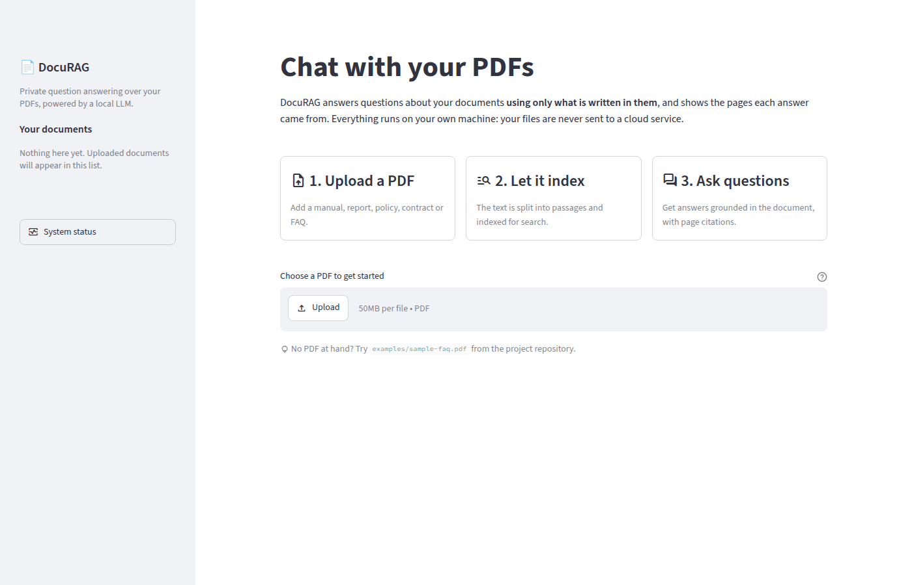
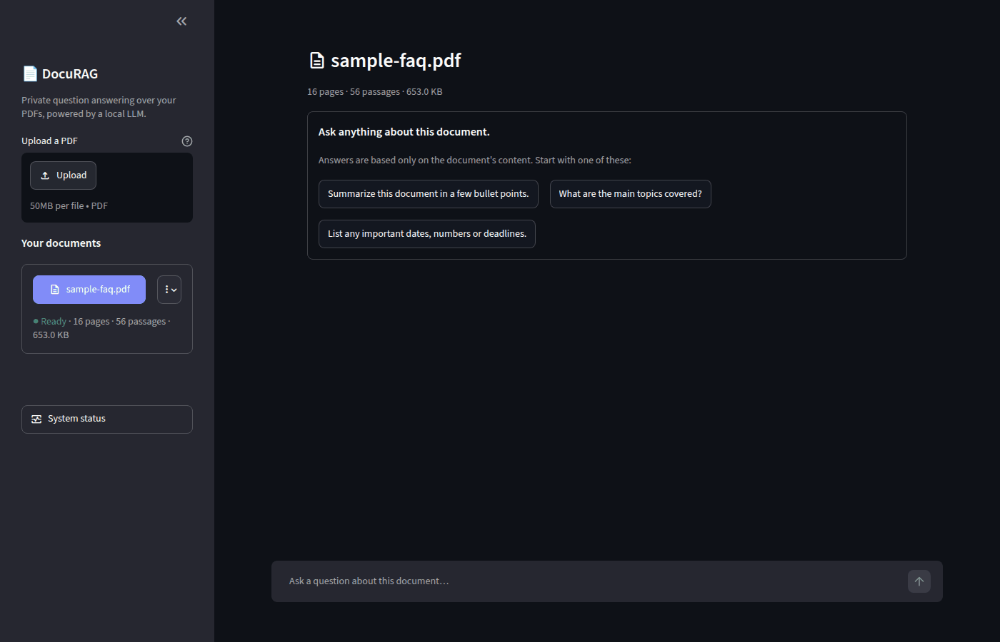
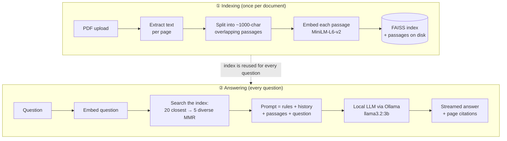
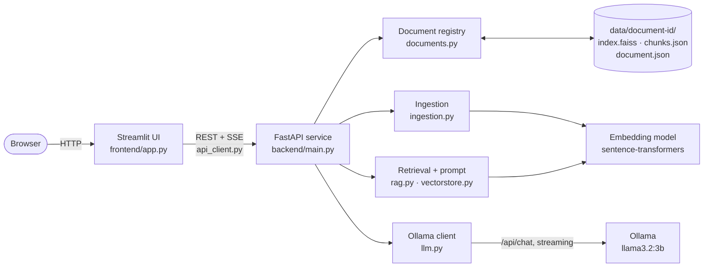
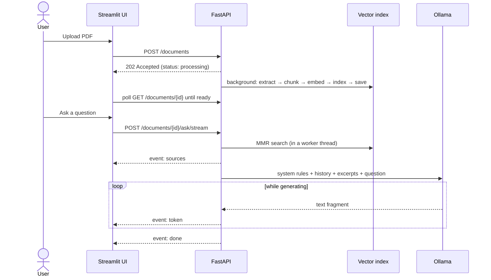

<div align="center">

# 📄 DocuRAG

**Chat with your PDF documents, privately, using an open-source LLM running on your own machine.**

Upload a PDF, ask questions in plain language, and get answers that are grounded in the document and cite the pages they came from.

[](https://github.com/sakshamg251206/DocuRAG/actions/workflows/ci.yml)


</div>

<p align="center">
  
</p>

---

## Contents

- [What is DocuRAG?](#what-is-docurag)
- [Features](#features)
- [How it works](#how-it-works)
- [Quick start](#quick-start)
- [Configuration](#configuration)
- [Running the tests](#running-the-tests)
- [Deployment](#deployment)
- [API reference](#api-reference)
- [Architecture](#architecture)
- [Technical decisions](#technical-decisions)
- [Limitations and future work](#limitations-and-future-work)

---

## What is DocuRAG?

Long documents such as manuals, policies, FAQs, contracts and reports are slow to search by hand, and keyword search
misses answers that are phrased differently from the question. General-purpose chatbots can help, but they
**make things up** when they don't know an answer, and using a hosted one means **sending your documents to a third party**.

DocuRAG addresses both problems:

- **Grounded answers.** The model only sees passages retrieved from *your* document and is instructed to answer from
  them alone, or to say the document doesn't cover the question. Every answer lists the pages it drew on, with the
  matching passage, so you can check it.
- **Fully local.** The language model runs through [Ollama](https://ollama.com) and the embedding model runs in-process.
  After the models are downloaded once, nothing leaves your machine.

The technique is called **Retrieval-Augmented Generation (RAG)**: first *retrieve* the relevant parts of the document,
then let the LLM *generate* an answer from them.

> **Why it exists.** DocuRAG began as a solution to a brief: *build a chatbot that answers questions about a PDF using a
> locally deployed open-source LLM, with a vector-database retrieval step, a simple UI, and bonus points for streaming,
> quantised inference and better retrieval.* It has since been reworked into a cleaner, tested, deployable application.

## Features

| | |
|---|---|
| **Chat with any text PDF** | Upload several documents and switch between them; each keeps its own conversation. |
| **Page citations** | Each answer shows the pages it used, with an excerpt of the passage, in an expandable *Sources* panel. |
| **Streaming answers** | Tokens appear as they are generated, so you aren't waiting on a blank screen. |
| **Follow-up questions** | Recent conversation turns are sent along, so "and what about the second one?" works. |
| **Diverse retrieval (MMR)** | Maximal Marginal Relevance avoids feeding the model five near-identical passages. |
| **Persistent library** | Indexed documents are saved to disk and restored on restart, with no re-uploading. |
| **Clear status & errors** | The UI tells you when Ollama is offline, a model is missing (with the exact `ollama pull` command), a PDF is scanned or password-protected, or the API is unreachable. |
| **Light & dark mode, mobile-friendly** | Follows your system theme; the layout works on small screens. |
| **REST API with OpenAPI docs** | Everything the UI does is available over HTTP at `/docs`. |
| **One-command deployment** | `docker compose up` starts Ollama, pulls the model, and runs the API and UI. |

<p align="center">
  
  <br><sub>A document after indexing (dark theme): starter questions, the document library and a status panel.</sub>
</p>

## How it works

There are two phases: **indexing** a document once when it is uploaded, and **answering** each question.



1. **Extract.** [pypdf](https://pypi.org/project/pypdf/) reads the text of each page. Whitespace is normalised and
   blank pages are skipped, but page numbers are kept so answers can cite them.
2. **Chunk.** Pages are split into ~1000-character passages with 200 characters of overlap, preferring paragraph and
   sentence boundaries, so that no passage loses the context around a sentence that straddles a boundary.
3. **Embed.** Each passage is turned into a 384-number vector by
   [`all-MiniLM-L6-v2`](https://huggingface.co/sentence-transformers/all-MiniLM-L6-v2), a small, fast model whose
   vectors are close together when texts mean similar things.
4. **Index.** Vectors are stored in a [FAISS](https://github.com/facebookresearch/faiss) index (exact cosine
   similarity) and saved to disk with the passages.
5. **Retrieve.** The question is embedded the same way; the 20 most similar passages are fetched, and MMR picks 5 that
   are relevant *and* different from each other.
6. **Generate.** The passages (labelled with their page numbers), the last few chat turns and the question go to the
   LLM with instructions to answer only from the excerpts. The answer streams back to the browser over
   Server-Sent Events.

## Quick start

### Prerequisites

- **Python 3.11+**
- **[Ollama](https://ollama.com/download)**, installed and running (`ollama serve`; the desktop app starts it automatically)
- About **3 GB of disk** for the models and **8 GB of RAM** recommended

> Prefer containers? Skip to [Deployment → Docker Compose](#docker-compose); you only need Docker.

### 1. Get the code and install dependencies

```bash
git clone https://github.com/sakshamg251206/DocuRAG.git
cd DocuRAG
make install          # creates .venv and installs everything (CPU-only PyTorch on Linux)
```

<details>
<summary>Without <code>make</code> (e.g. on Windows)</summary>

```bash
python -m venv .venv
# macOS/Linux: source .venv/bin/activate      Windows: .venv\Scripts\activate
pip install -r requirements-dev.txt
```

On Linux, run `pip install torch --index-url https://download.pytorch.org/whl/cpu` first to avoid downloading
~2 GB of GPU libraries you don't need.
</details>

### 2. Download the language model

```bash
ollama pull llama3.2:3b
```

### 3. Start the API and the UI (two terminals)

```bash
make api      # API on http://localhost:8000  (interactive docs at /docs)
make ui       # UI  on http://localhost:8501
```

Open **http://localhost:8501**, upload a PDF (try [`examples/sample-faq.pdf`](examples/sample-faq.pdf), a 16-page
utility-company FAQ) and ask, for example, *"How can I submit my meter reading if it was missed?"*

The first upload takes a little longer because the embedding model (~90 MB) is downloaded once and cached.

<details>
<summary>Without <code>make</code></summary>

```bash
uvicorn backend.main:app --reload --reload-dir backend --port 8000
streamlit run frontend/app.py      # run from the repository root so .streamlit/config.toml is picked up
```
</details>

## Configuration

All settings are optional environment variables; defaults are shown. Copy [`.env.example`](.env.example) to `.env`
to change them. The API reads `.env` itself, and `make` also exports it to the UI.

| Variable | Default | Purpose |
|---|---|---|
| `OLLAMA_BASE_URL` | `http://localhost:11434` | Where Ollama is listening. |
| `LLM_MODEL` | `llama3.2:3b` | Any chat model installed in Ollama, e.g. `mistral`, `llama3.1:8b`, `qwen2.5:7b`. |
| `LLM_TEMPERATURE` | `0.1` | Lower is more deterministic and factual. |
| `LLM_TIMEOUT_SECONDS` | `300` | Maximum time to wait for the model to generate an answer. |
| `EMBED_MODEL` | `sentence-transformers/all-MiniLM-L6-v2` | Any sentence-transformers model. Changing it requires re-uploading documents. |
| `CHUNK_SIZE` / `CHUNK_OVERLAP` | `1000` / `200` | Passage length and overlap, in characters. |
| `RETRIEVAL_K` / `RETRIEVAL_FETCH_K` | `5` / `20` | Passages sent to the LLM / candidates considered by MMR. |
| `HISTORY_TURNS` | `6` | Previous chat messages included for follow-up questions (`0` disables). |
| `MAX_PDF_SIZE_MB` | `50` | Upload limit, enforced by both the API and the UI. |
| `DATA_DIR` | `data` | Where indexed documents are stored. |
| `PERSIST_DOCUMENTS` | `true` | Set to `false` to keep documents in memory only. |
| `CORS_ORIGINS` | `http://localhost:8501` | Comma-separated browser origins allowed to call the API. |
| `LOG_LEVEL` | `INFO` | API log verbosity. |
| `DOCURAG_API_URL` | `http://localhost:8000` | *(UI only)* where the UI finds the API. |

Invalid combinations, such as an overlap larger than the chunk size, are rejected at startup with a clear message.

## Running the tests

```bash
make check     # lint + type-check + tests: exactly what CI runs
make test      # tests only
```

The suite (64 tests) runs in a few seconds and **needs neither Ollama nor the embedding model**: the LLM is replaced by
an in-process fake of Ollama's HTTP API, and embeddings by a deterministic fake. It covers:

- **Ingestion:** text extraction, blank/scanned/corrupt PDFs, chunking that keeps page numbers, the sample document.
- **Retrieval & prompting:** MMR diversity, history trimming, citation de-duplication, index save/load round-trips.
- **API:** upload validation (type, magic bytes, size, filename sanitising), the document lifecycle, persistence
  across restarts, CORS, streaming event order, and how LLM failures are reported.
- **LLM client:** streaming, missing-model and connection errors, errors in the middle of a stream.
- **UI:** the real Streamlit script driven by `streamlit.testing`: welcome, offline and failure states, asking
  questions, starter questions and follow-up history.

Code quality is enforced with [Ruff](https://docs.astral.sh/ruff/) (lint + format) and [mypy](https://mypy-lang.org/)
in strict mode. GitHub Actions runs everything on Python 3.11 and 3.12 and builds both Docker images.

## Deployment

### Docker Compose

The simplest way to run the whole stack, on any machine with Docker:

```bash
docker compose up --build -d      # or: make docker-up
```

Then open **http://localhost:8501**. Compose starts four services:

| Service | Role |
|---|---|
| `ollama` | Serves the LLM. Models are kept in the `ollama` volume. |
| `ollama-pull` | One-off job that downloads `LLM_MODEL` (~2 GB for the default) and exits. |
| `api` | The FastAPI service. Indexed documents and the embedding-model cache live in volumes. |
| `ui` | The Streamlit interface, started once the API reports healthy. |

Use another model with `LLM_MODEL=mistral docker compose up -d`. The first start takes a while as models download;
watch it with `docker compose logs -f`. To use an NVIDIA GPU for Ollama, add a
[GPU reservation](https://docs.docker.com/compose/how-tos/gpu-support/) to the `ollama` service.

### Elsewhere

The API and UI are ordinary containers ([`docker/api.Dockerfile`](docker/api.Dockerfile),
[`docker/ui.Dockerfile`](docker/ui.Dockerfile)) that run as a non-root user and include health checks. When deploying
them separately, point `OLLAMA_BASE_URL` and `DOCURAG_API_URL` at the right hosts, mount a volume at `/app/data`, and
put both behind a reverse proxy with TLS.

> **Security note.** The API has no authentication: it is designed to run on your own machine or a trusted network.
> If you expose it publicly, put it behind an authenticating reverse proxy or VPN.

## API reference

Interactive documentation is served at **http://localhost:8000/docs**.

| Method | Path | Description |
|---|---|---|
| `GET` | `/health` | API version, Ollama reachability, whether the model is installed, document counts. |
| `GET` | `/documents` | List documents (newest first) with status, pages and passage counts. |
| `POST` | `/documents` | Upload a PDF (`multipart/form-data`, field `file`). Returns `202` and indexes in the background. |
| `GET` | `/documents/{id}` | One document's status: `processing`, `ready` or `failed` (with a reason). |
| `DELETE` | `/documents/{id}` | Delete a document and its index. |
| `POST` | `/documents/{id}/ask` | Ask a question and receive the full answer as JSON. |
| `POST` | `/documents/{id}/ask/stream` | Ask a question and stream the answer as Server-Sent Events. |

```bash
# Upload, then ask (replace <id> with the id from the first response)
curl -F "file=@examples/sample-faq.pdf" http://localhost:8000/documents
curl -X POST http://localhost:8000/documents/<id>/ask \
     -H "Content-Type: application/json" \
     -d '{"question": "What is self-billing?", "history": []}'
```

The stream emits `sources` (citations) first, then one `token` event per text fragment, and finally `done`
(or `error`, with a human-readable `detail`). Every `data` field is JSON, so newlines in the answer survive transport.

## Architecture





### Project structure

```
DocuRAG/
├── backend/                  FastAPI service
│   ├── main.py               App factory, routes, background indexing, SSE streaming
│   ├── config.py             Typed settings from environment variables / .env
│   ├── schemas.py            Request/response models
│   ├── documents.py          Thread-safe document registry + on-disk persistence
│   ├── ingestion.py          PDF text extraction and chunking
│   ├── vectorstore.py        FAISS index with MMR search and JSON persistence
│   ├── embeddings.py         Cached sentence-transformers model
│   ├── rag.py                Retrieval, prompt construction, citations
│   ├── llm.py                Async streaming client for Ollama
│   └── requirements.txt
├── frontend/                 Streamlit UI
│   ├── app.py                Pages, chat, document library, status handling
│   ├── api_client.py         Typed HTTP/SSE client (no Streamlit dependency)
│   └── requirements.txt
├── tests/                    pytest suite (backend + frontend), no models required
├── docker/                   Dockerfiles for the API and UI
├── docs/screenshots/         Images used in this README
├── examples/sample-faq.pdf   Sample document to try
├── .streamlit/config.toml    UI theme and upload limit
├── .github/workflows/ci.yml  Lint, type-check, test, Docker build
├── docker-compose.yml        Ollama + API + UI
├── Makefile                  install / api / ui / test / check / docker-up …
├── pyproject.toml            Project metadata and tool configuration
├── requirements-dev.txt      All runtime + development dependencies
└── .env.example              Every setting, documented
```

### Tech stack

| Layer | Technology | Why |
|---|---|---|
| LLM runtime | **Ollama** | Simple local model server; ships 4-bit quantised builds by default, which makes CPU inference practical. |
| Default LLM | **Llama 3.2 3B** | Small enough for a laptop, good at following "answer only from the context" instructions. |
| Embeddings | **sentence-transformers** `all-MiniLM-L6-v2` | Fast on CPU, small (~90 MB), strong for semantic search. |
| Vector search | **FAISS** | Proven, fast exact similarity search in-process; no database server to run. |
| Text processing | **pypdf**, **LangChain** text splitters | Reliable extraction; a well-tested recursive splitter. |
| API | **FastAPI**, **Pydantic**, **httpx** | Typed validation, automatic OpenAPI docs, async streaming. |
| UI | **Streamlit** | A clean, responsive chat UI in pure Python. |
| Quality | **pytest**, **Ruff**, **mypy**, **GitHub Actions** | Fast feedback locally and in CI. |

## Technical decisions

- **Separate API and UI.** The RAG pipeline is an HTTP service with its own OpenAPI contract, so it can be scripted,
  tested in isolation and reused by other clients. The UI is a thin client over it.
- **Indexing in the background.** Uploads return immediately with `202 Accepted`; the UI polls status. Large PDFs never
  hit HTTP timeouts and the interface stays responsive.
- **Nothing CPU-heavy on the event loop.** Embedding and FAISS search run in worker threads, so one user's question
  doesn't stall everyone else's streams.
- **A small FAISS wrapper instead of a framework vector store.** `vectorstore.py` is ~90 lines of code. It normalises
  vectors so scores are true cosine similarities, implements MMR, and persists passages as **plain JSON** instead of
  pickles, so loading saved data can never execute code. Indexes also record which embedding model produced them and are
  skipped (with a log message) if the model changes, instead of silently returning nonsense.
- **Ollama's chat endpoint with structured messages.** The model's own chat template is applied, the system rules are
  kept separate from the user's text, and retrieved context is attached only to the current question, so prompts stay
  small in long conversations.
- **JSON-encoded Server-Sent Events.** Raw tokens often contain newlines, which break naïve SSE framing and used to
  strip line breaks from answers. Encoding each event's data as JSON makes the stream lossless.
- **Defensive uploads.** Uploads are checked for extension, PDF magic bytes and size while streaming to a temp file,
  so oversized files are rejected without being held in memory. Filenames are reduced to their base name.
- **Friendly, specific errors.** Failures are translated into actionable messages ("Run `ollama pull llama3.2:3b`",
  "No selectable text was found… needs OCR") rather than stack traces.
- **Testable by design.** The app is built by a factory that accepts the embedding model and LLM client, which is
  what lets the whole suite run without downloading any model.

## Limitations and future work

**Current limitations**

- **Text-based PDFs only.** Scanned or image-only PDFs have no extractable text and are rejected with an explanation
  (OCR is not included).
- **One document per conversation.** You can't yet ask a question across several documents at once.
- **Answer quality depends on the model.** A 3B model is fast but can miss nuance in complex documents; larger models
  (`llama3.1:8b`, `qwen2.5:7b`, …) answer better but need more RAM and time.
- **Tables and layout.** Text is extracted in reading order; complex tables and multi-column layouts may be flattened
  imperfectly.
- **No authentication or multi-user separation.** All users of one API instance share the same document library.
  Chat history lives in the browser session and is not saved.

**Possible next steps**

- OCR for scanned documents (e.g. Tesseract), and better table extraction.
- Questions across multiple documents, with per-document citations.
- Hybrid retrieval (BM25 + vectors) and a cross-encoder re-ranker for higher answer accuracy.
- Choosing the LLM from the UI, from the models installed in Ollama.
- An evaluation set of questions and expected answers, to measure retrieval and answer quality when changing settings.
